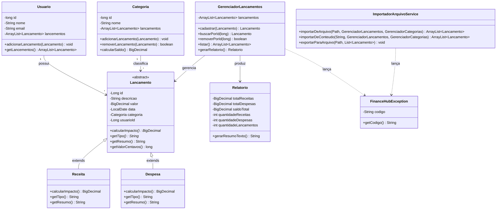
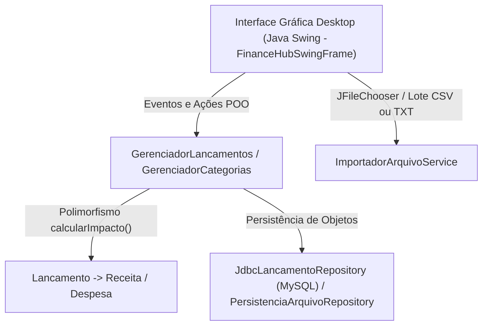

# Diagramas do Projeto FinanceHub (PjBL POO)

## 1. Diagrama de Classes (Domínio, Serviços e Exceções)

```mermaid
classDiagram
    class Usuario {
        -long id
        -String nome
        -String email
        -ArrayList~Lancamento~ lancementos
        +adicionarLancamento(Lancamento) void
        +getLancementos() ArrayList~Lancamento~
    }

    class Categoria {
        -long id
        -String nome
        -ArrayList~Lancamento~ lancamentos
        +adicionarLancamento(Lancamento) void
        +removerLancamento(Lancamento) boolean
        +calcularSaldo() BigDecimal
    }

    class Lancamento {
        <<abstract>>
        -Long id
        -String descricao
        -BigDecimal valor
        -LocalDate data
        -Categoria categoria
        -Long usuarioId
        +calcularImpacto()* BigDecimal
        +getTipo()* String
        +getResumo() String
        +getValorCentavos() long
    }

    class Receita {
        +calcularImpacto() BigDecimal
        +getTipo() String
        +getResumo() String
    }

    class Despesa {
        +calcularImpacto() BigDecimal
        +getTipo() String
        +getResumo() String
    }

    class Relatorio {
        -BigDecimal totalReceitas
        -BigDecimal totalDespesas
        -BigDecimal saldoTotal
        -int quantidadeReceitas
        -int quantidadeDespesas
        -int quantidadeLancamentos
        +gerarResumoTexto() String
    }

    class FinanceHubException {
        -String codigo
        +getCodigo() String
    }

    class GerenciadorLancamentos {
        -ArrayList~Lancamento~ lancamentos
        +cadastrar(Lancamento) Lancamento
        +buscarPorId(long) Lancamento
        +removerPorId(long) boolean
        +listar() ArrayList~Lancamento~
        +gerarRelatorio() Relatorio
    }

    class ImportadorArquivoService {
        +importarDeArquivo(Path, GerenciadorLancamentos, GerenciadorCategorias) ArrayList~Lancamento~
        +importarDeConteudo(String, GerenciadorLancamentos, GerenciadorCategorias) ArrayList~Lancamento~
        +exportarParaArquivo(Path, List~Lancamento~) void
    }

    Lancamento <|-- Receita : extends
    Lancamento <|-- Despesa : extends
    Usuario "1" --> "*" Lancamento : possui
    Categoria "1" --> "*" Lancamento : classifica
    GerenciadorLancamentos --> Lancamento : gerencia
    GerenciadorLancamentos --> Relatorio : produz
    GerenciadorLancamentos ..> FinanceHubException : lança
    ImportadorArquivoService ..> FinanceHubException : lança
```

---

## 2. Fluxograma de Execução e Arquitetura

```mermaid
flowchart TD
    UI["Interface Gráfica Desktop (Java Swing - FinanceHubSwingFrame)"] -->|"Eventos e Ações POO"| SVC["GerenciadorLancamentos / GerenciadorCategorias"]
    UI -->|"JFileChooser / Lote CSV ou TXT"| CSV["ImportadorArquivoService"]
    SVC -->|"Polimorfismo calcularImpacto()"| DOM["Lancamento -> Receita / Despesa"]
    SVC -->|"Persistência de Objetos"| DB["JdbcLancamentoRepository (MySQL) / PersistenciaArquivoRepository"]
```

